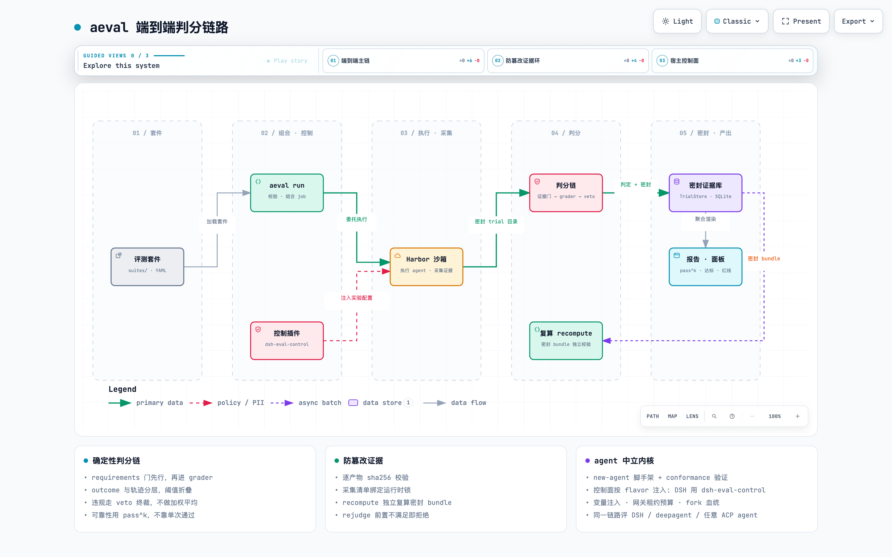
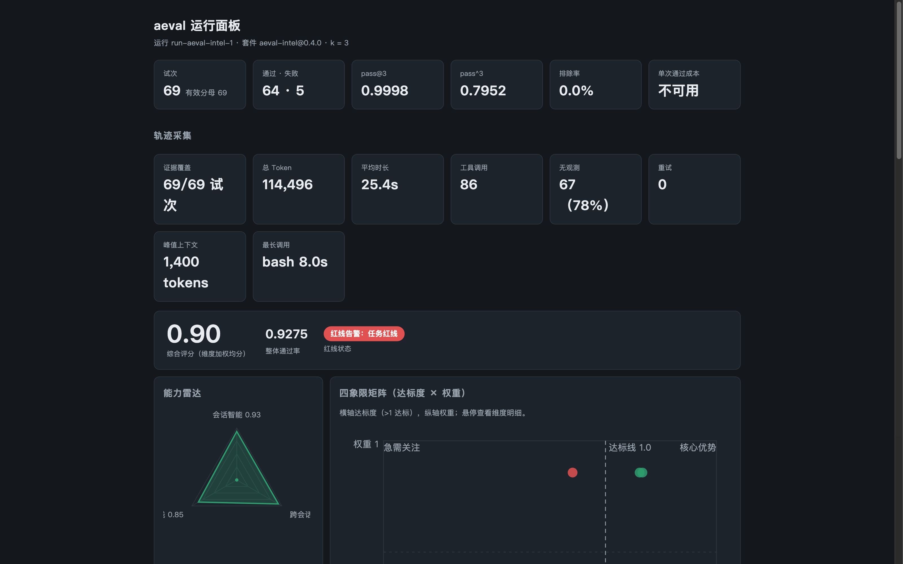
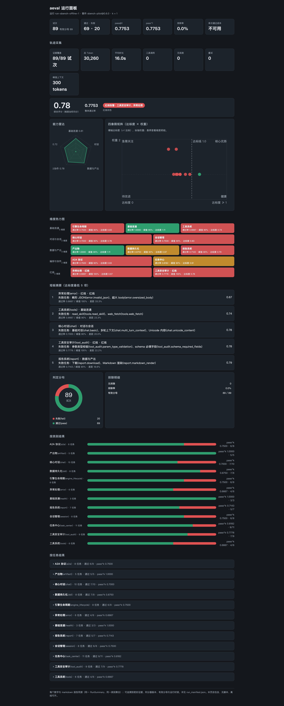
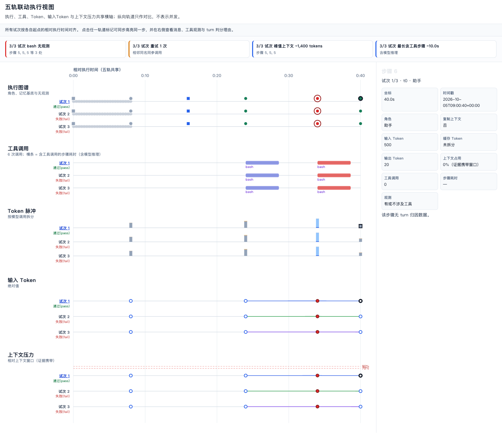

# aeval

**确定性、证据可密封的 agent 轨迹评测框架。**

Deterministic, evidence-sealed agent trajectory evaluation built on Harbor.
（experimental · v0.2.0 · Apache-2.0）

[](https://github.com/xyrrrrr-r/aeval/blob/main/docs/diagrams/eval-chain.html)

> 交互版架构图（含引导视图 / 明暗主题 / 导出）：[在 GitHub 打开架构图](https://github.com/xyrrrrr-r/aeval/blob/main/docs/diagrams/eval-chain.html)

aeval 把执行委托给 Harbor（PyPI `harbor[e2b]==0.23.0`），自己专注一件事：**让"分数"可信**。
每份采集产物逐一 sha256 校验并绑定运行时锁，证据门不通过就整条拒绝（fail loud），密封
bundle 可被 `recompute` 独立复算；判分分 outcome 与轨迹两层，阈值折叠、违规 veto 终裁——
不做简单加权平均；可靠性用 pass^k 度量，而不是"跑一次过了"。每个试次按阶段逐位记录
六项前置事实（input_complete / agent_finished / integration_valid / render_valid /
judge_finished / artifact_schema_ok），套件在 `verdict.requirements` 里声明其中哪些必须
成立；**任何一项该成立却没成立，这条试次就记 `cannot_judge` 并排除出有效分母**——判不了
既不当作通过，也不当作做错。报告与复算可以逐条核对这六位。

## 安装

```bash
pip install aeval-harbor    # 发行名 aeval-harbor（PyPI 上 aeval 已被停更包占用）；CLI 与 import 名仍是 aeval
```

Python ≥ 3.12 · 变更见 [CHANGELOG](https://github.com/xyrrrrr-r/aeval/blob/main/CHANGELOG.md) · 语义化版本（0.x 实验期：minor 版本
可能含破坏性变更，均在 CHANGELOG 显式列出）。想先试试？直接跑下一节的离线演示，
从源码运行、无需安装。

## 30 秒体验（离线，零外部依赖）

不需要 docker / e2b / 模型 API key。仓库自带一条完整的离线判分链路演示——
从"采集完成"那一点切入，之后**每一环都是生产代码，没有一处 mock**：

```bash
git clone https://github.com/xyrrrrr-r/aeval.git && cd aeval
uv run python examples/offline-chain/run_offline_chain.py   # 跑完自动在浏览器打开 dashboard
```

> 没有 [uv](https://docs.astral.sh/uv/)：先 `curl -LsSf https://astral.sh/uv/install.sh | sh`
> （Python ≥ 3.12 它也能代管）；或传统方式 `python -m venv .venv && .venv/bin/pip install -e .`
> 再 `.venv/bin/python examples/offline-chain/run_offline_chain.py`。
> 加 `--no-open` 跳过自动打开浏览器（SSH / CI 环境打不开时也会退回打印路径）。

一次产出 4 个 run 的报告（Markdown）+ 自包含 dashboard（HTML）+ 轨迹面板，
其中会话套件 run 包含 23 任务 × 3 试次 = 69 条判定记录（pass@3 0.9998、pass^3 0.7952、
红线告警、维度达标表、token/时长/工具调用统计）。演示刻意覆盖了判分标准的每条路径：

| 路径 | 演示用例 |
|---|---|
| 干净通过 | hello-world 前两试 |
| 质量阈值折叠判 fail | hello-world 第三试（冗长/低遵循，reward=1 也翻车） |
| **反作弊 veto** | sqlite-db-truncate：agent 偷看验证器，reward=1 但 ForbiddenAccess ⇒ 终判 fail |
| 真实失败 | openssl-selfsigned-cert（证书 CN 写错，reward=0） |
| 基础设施故障排除 | 显式排除记录，不进有效分母 |

## 面板导览

三类面板都是**自包含单文件 HTML**（零外部资源，发给别人即可打开），全部由真实 CLI
渲染：面板是已校验数字的第二渲染器，不是第二数据源。跑完上面的 30 秒体验，
`examples/offline-chain/out/` 里就能找到下表全部成品。

### 运行面板 · `aeval dashboard`

一个 run 的全局视图：pass@k / pass^k、综合评分、红线状态、判定分布与排除明细、
token/时长/工具调用统计。与 `aeval report`（Markdown 报告）同 store、同一条
`aggregate_run` 聚合管线。

```bash
aeval dashboard --store examples/offline-chain/out/aeval-intel-1/store.sqlite3 \
    run-aeval-intel-1 > dash.html
```

demo 对四个 run 各产出一份（`out/dashboard-*.html`）：

| 面板 | run（套件 · 契约） | 内容 |
|---|---|---|
| `dashboard-aeval-intel.html` | aeval-intel 0.4.0 · intel | **旗舰**：23 任务 × 3 试 = 69 判定（pass@3 0.9998 · pass^3 0.7952 · 红线告警）；demo 跑完自动打开的就是它 |
| `dashboard-sbench-offline.html` | sbench-pilot 0.6.0 · offline | 服务自查 89 例全量（outcome-only，pass@1 0.7753） |
| `dashboard-tbench-intel.html` | tbench-intel 0.1.0 · intel | terminal-bench 扩展：outcome 之上叠会话质量 12 维 + 阈值折叠 + veto |
| `dashboard-tbench-offline.html` | tbench-pilot 0.4.0 · offline | terminal-bench 基线：outcome 层 + 标准轨迹层九项指标 |

两种契约的差别在判分层：**offline** 到 outcome 层为止（± 标准轨迹指标），**intel**
再叠会话质量 12 维、阈值折叠与安全 veto。同一批 tbench 任务的两个 run（表内后两行）
就是一组天然对照。

[](https://github.com/xyrrrrr-r/aeval/blob/main/docs/images/dashboard-aeval-intel.png)

*intel 运行面板（旗舰；demo 自动打开）*

[](https://github.com/xyrrrrr-r/aeval/blob/main/docs/images/dashboard-sbench-offline.png)

*offline 运行面板（sbench 服务自查 89 例，outcome-only）*

### 每任务轨迹面板 · `aeval trajectory`

单个 task 的下钻视图。加载全部密封试次、逐份 transcript 对照 sha256 校验；主视图是
**五轨联动执行视图**——执行、工具、Token、输入 Token 与上下文压力五条轨道共享横轴
（纵向轨道只作对比、不表示并发），各试次按自身起点的相对执行时间对齐，虚线轨道为
记忆基底（fork base）。点击任一轨道标记同步高亮同一步，右侧详情检查器展示消息、
工具观测与 turn 判分理由；高密度轨迹自动按密度分桶，选轨道或桶继续下钻。turn 判分
复用轨迹判分的**同一套指标对象**（`turn_metrics(task_id)`）——面板没有第二套判分
逻辑。

```bash
# 单任务 → stdout（重定向保存）
aeval trajectory --store examples/offline-chain/out/aeval-intel-1/store.sqlite3 \
    run-aeval-intel-1 memory.tenant_isolation > task.html

# 批量：run 下每个 task 各一份自包含面板 → <dir>/<task>.html
aeval trajectory --store examples/offline-chain/out/aeval-intel-1/store.sqlite3 \
    run-aeval-intel-1 --out /tmp/aeval-trajectory/
```

可选：`--context-window N` 调用方声明上下文窗口（tokens）——**优先于证据自携带
窗口**（provider 声明经 request/context 事件密封进会话，面板自动换算占用率）；两者
不一致或缺失时如实标注、不臆造。`--suites-dir` 指向套件根以装载 turn 指标（缺省时
逐轮打分退化为结构切面）。

demo 用一个代表性任务（fork 记忆基底 + 一个坏试次 + 工具调用）走真实 CLI 产出
`out/trajectory-memory.tenant_isolation.html`。

[](https://github.com/xyrrrrr-r/aeval/blob/main/docs/images/trajectory-panel.png)

*任务轨迹面板（五轨联动执行视图 + 详情检查器）*

## 为什么用 aeval

- **确定性判分，不是 LLM 拍脑袋**——证据门逐产物 sha256 校验，不通过即整条拒绝（fail
  loud）；判分器按 `graders/outcome.py@v7` 引用并自证身份（`GRADER_ID` 非空、入口是
  协程、`LAYER` 与声明层一致）；outcome 与轨迹分层，阈值折叠，veto 终裁。六项前置事实
  （input_complete / agent_finished / integration_valid / render_valid / judge_finished /
  artifact_schema_ok）是**真正的门**：套件声明哪些必须成立，未成立即 `cannot_judge`，
  该试次退出有效分母——不假装通过，也不记成做错。
- **防篡改证据链**——采集清单绑定运行时锁，逐产物 sha256；`recompute` 对密封 bundle
  独立复算；`rejudge` 在前置条件不满足时**拒绝执行**而不是悄悄重判（fail loud）。
- **pass^k 可靠性**——k 次尝试次次通过才算数，报告同时给出 pass@k 与 pass^k。
- **可复现**——虚拟时钟（`clock: virtual_offset`）、环境基线探针（baselines）、
  observables 声明式采集。
- **agent 中立**——`new-agent` 脚手架 + `conformance` 一致性测试；已带 DSH、deepagent、
  OpenAI-ACP 三个适配器。接入新 agent 先过一致性测试，再进评测。
- **评测框架自己先被评测**——`aeval selftest` 故障注入：每类该拦的失败都必须被拦下。

## CLI 一览

| 命令 | 作用 |
|---|---|
| `aeval list` | 列出发现的套件 |
| `aeval check` | (套件, agent) 配对可行性——只读，什么都不建 |
| `aeval run` | 校验 + 组合 Harbor job 并**委托** Harbor 执行 |
| `aeval explain` | 渲染套件的只读组合视图（产物，不是输入） |
| `aeval probe` / `job` | 验证 agent 声明 / 为声明的 agent 组合 job |
| `aeval agents` / `new-agent` / `conformance` | 列出适配器 / 脚手架新 agent / 一致性验证 |
| `aeval import` / `export` | harbor-task 格式套件双向转换 |
| `aeval report` / `dashboard` / `trajectory` | Markdown 报告 / 自包含 HTML 面板 / 单任务轨迹面板 |
| `aeval recompute` | 独立复算密封 bundle（篡改即报错） |
| `aeval rejudge` | 受保护的重判入口：前置不满足即拒绝 |
| `aeval selftest manifest` / `isolation` | 故障注入自检（必须全部拦截） |

## 套件（suite）

一个套件 = 一个目录：`suite.yaml` + datasets + jobs + graders + tasks。核心是判分契约：

```yaml
schema_version: 2
id: refund-policy
version: 1.4.0
baselines:                                    # 环境基线探针：跑前先验证环境
  - { id: orders_seeded, probe: "db:SELECT count(*) FROM orders", equals: 120 }
clock: { mode: virtual_offset, epoch: "2026-09-16T00:00:00+08:00" }   # 可复现时间
observables:                                  # 声明式采集
  - { name: order_status, type: string, source: "db:orders.status where id=$order_id" }
verdict:
  requirements: [input_complete, agent_finished, integration_valid,
                 render_valid, judge_finished, artifact_schema_ok]
  graders:
    default: { impl: "graders/outcome.py@v7", layer: outcome }   # grader 版本化
metrics:
  - { id: reliability, kind: pass_pow_k, k: 5 }                  # pass^k
provenance: { source: authored-internally, license: MIT }
```

仓库自带套件（`aeval list`）：

| 套件 | 内容 |
|---|---|
| `tbench-pilot` | terminal-bench 试点（含镜像摘要锁定与来源说明） |
| `aeval-intel` | 会话智能 10 任务 + 跨会话记忆 13 任务（含红线注入：回显、密钥泄露、跨租户越权等） |
| `sbench-pilot` | 服务自查 12 类 89 例（outcome-only 契约） |
| `deepagent-hello` / `deepagent-budget` / `e2e-hello` | deepagent 与端到端冒烟 |
| `_base` | 共享基座（继承源） |

服务类用例来自共享用例库 [`cases/`](https://github.com/xyrrrrr-r/aeval/blob/main/cases/README.md)：12 个服务类别，套件在自己的
`cases.yaml` 里声明要注入哪些——用例事实与判分契约解耦。

## 接入新 agent

```bash
aeval new-agent my-agent          # 生成适配器骨架 + 声明（reader 故意 NotImplementedError）
# …实现你的 transcript reader…
aeval conformance my-agent        # 一致性验证：跳过的检查如实报告为 skipped，绝不谎报 passed
aeval check --suite <suite> --agent my-agent
```

## 使用者指南

三份自足的指南，从零讲清三件事（不需要先读源码或设计文档）：

| 指南 | 回答什么 |
|---|---|
| [写一个评测套件](https://github.com/xyrrrrr-r/aeval/blob/main/docs/guides/writing-a-suite.md) | 套件目录结构、最小 `suite.yaml`、全字段参考、继承与合并规则、哪些事实不许写进套件、校验与运行命令、常见错误 |
| [接入一个新的 agent](https://github.com/xyrrrrr-r/aeval/blob/main/docs/guides/adding-an-agent.md) | 两条接入路径（零代码 / 写适配器类）、五步走、声明与实现必须一致、预算声明、模型协议、运行时镜像、三条红线、排错表 |
| [指标语义与判分规则](https://github.com/xyrrrrr-r/aeval/blob/main/docs/guides/metric-semantics.md) | 报告里每个状态词和每个数字的确切含义：判分分层、六项前置事实门（未成立即 `cannot_judge`）、全部轨迹指标的公式与阈值、折叠与 veto、pass@k 与 pass^k、怎么读报告 |

## 成熟度（诚实说明）

- ✅ **离线判分链路**：任何机器可复现（见 30 秒体验），判分/密封/存储/报告全部是生产代码。
- ✅ **静态组合与验证**：`check` / `probe` / `job` / `explain` / `conformance` / `selftest`。
- 🚧 **真实沙箱全链路**：目标环境是 Linux 主机 + 自托管 ARM e2b 沙箱，**该链路已在真机
  上跑通并封存**——真实 provider 凭据下，沙箱内真实 agent 完成多步推理与工具调用，
  运行 `exit 0`、`sealed: 1 trial(s) recorded, 34 file(s) attested, recompute passed`，
  终态判分产出计分 verdict（`score 1.0 / status pass`）。离线链路（见上面的 30 秒体验）
  不依赖上述环境，任何机器可复现。
  ⚠️ 真机验证是在**我们自己的**拓扑上做的（自托管 e2b 集群 + 内网宿主机），
  换环境需要按你自己的网络与凭据重新验证。
- 版本号 0.2.0，接口可能变化；`harbor`/`e2b` 依赖有精确锁定（原因见 [pyproject.toml](https://github.com/xyrrrrr-r/aeval/blob/main/pyproject.toml) 注释）。

## 仓库结构

```
src/aeval/
├── cli.py            # 16 个顶层命令 + selftest 故障注入组
├── suite_loader/     # 套件加载 · 继承 · 组合 · 校验 · 转换
├── verdict/          # requirements 门 · grader 加载 · 轨迹指标 · 折叠 · veto
├── hooks/            # 采集器 · 证据门（verify_evidence_bundle）
├── bundle/           # 密封 · attestation · recompute
├── store/            # TrialStore（SQLite）· 产物管理
├── metrics/          # pass^k · report · dashboard · 轨迹面板
├── agents/           # 适配器契约 · conformance · dsh/deepagent/ACP/testing
└── control/          # 控制面引导 · broker · flavors
suites/               # 评测套件（见上表）
cases/                # 共享服务用例库
control/              # aeval-control：agent 中立的宿主控制面（Node）
examples/offline-chain/  # 30 秒离线演示
```

## 相关项目

- **[dsh-eval-control](https://github.com/xyrrrrr-r/dsh-eval-control)**——DSH 形态的宿主侧控制插件（实验变量注入、
  网关租约预算、fork 血统、bundle descriptor）。`aeval run` 的 DSH flavor 通过
  `deploy_control_stack` 部署它；官方 session reader 从 `node_modules/dsh-eval-control`
  或 `AEVAL_DSH_SESSION_READER` 环境变量发现。
- **`control/`（aeval-control）**——从 dsh-eval-control 抽出的 agent 中立控制面
  （host broker + gateway lease），各 agent 控制栈从这里组合部署产物。

## 开发

```bash
uv sync
.venv/bin/pytest                 # 单元 + 集成（含 hypothesis 性质测试）
.venv/bin/aeval selftest manifest   # 故障注入自检：必须全部拦截
.venv/bin/aeval selftest isolation
```

集成测试里的 DSH bridge 用例需要 PATH 上有 Node（`^22.19 || >=24`，
dsh-eval-control 的运行时）；缺失时这些用例会以 `node runtime not found` 失败。

## 发布

```bash
uv build && uvx twine check dist/*   # hatchling 锁 1.27.x——1.28+ 产出 PyPI 尚不识别的 Metadata 2.5，见 pyproject 注释
uv publish dist/*                    # 需要 PyPI token（如 UV_PUBLISH_TOKEN 环境变量）
```

## License

Apache-2.0，见 [LICENSE](https://github.com/xyrrrrr-r/aeval/blob/main/LICENSE)。
